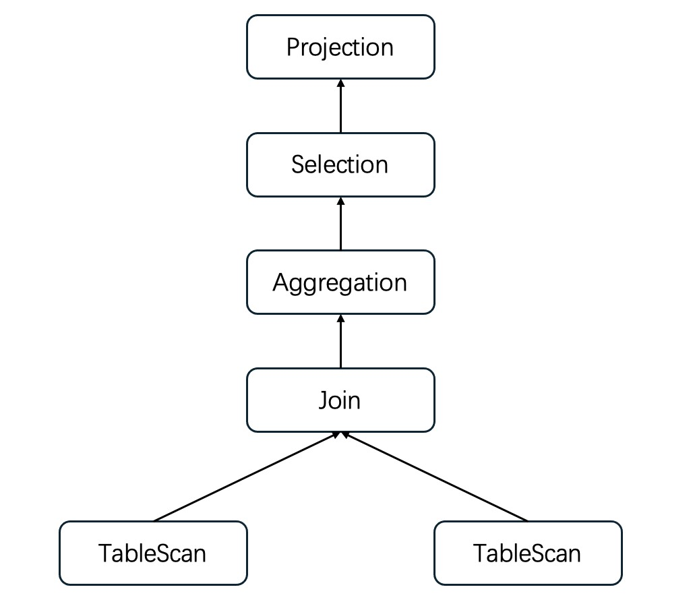

# Database Architecture
## Sharded Table & Shard Key
In our distributed database, in addition to normal table, all data of which is stored in a single storage node, we also supports distributing tuples of a table on several independent nodes. Such table is called a *Sharded Table*. 

Where a tuple locates is determined by the hash value of a special column called a *Shard Key*. A shard key must be specified when a table is created.

## Storage Layer

The storage layer is formed by several independent MySQL groups, each of which is in fact a paxos group. You can simply consider a paxos group a unique, undying MySQL server. For simplicity, we call such group a MySQL node.

## Query Execution Process
A query is parsed into an AST, based on which we create a *LogicalPlan*. The process is intricate, but simply put, we visit tree nodes following a certain order: With clause, From clause, Where clause, Aggregation clause, ... During such steps, we generate *LogicalPlanNodes* and assembly them into a tree structure.

After that, optimizers come into place. We apply optimizing rules to the LogicalPlan, making it, ideally, more time and memory efficient.

An optimized plan is then converted into an execution plan, which is finally used in real execution.

## Logical Plan
A Logical Plan has a tree structure, where data is generated at the leaf node and flows to the root. 

Data received by a non-leaf node usually undergoes some modification before being transferred to another node, including filtering out unwanted rows(Selection), removing or adding extra columns(Projection), matching rows between two children(Join), etc. 

In this way, data moves from below to above and is returned to the client at root node. The whole process is similar to magma rises to the surface during volcanic eruption.

