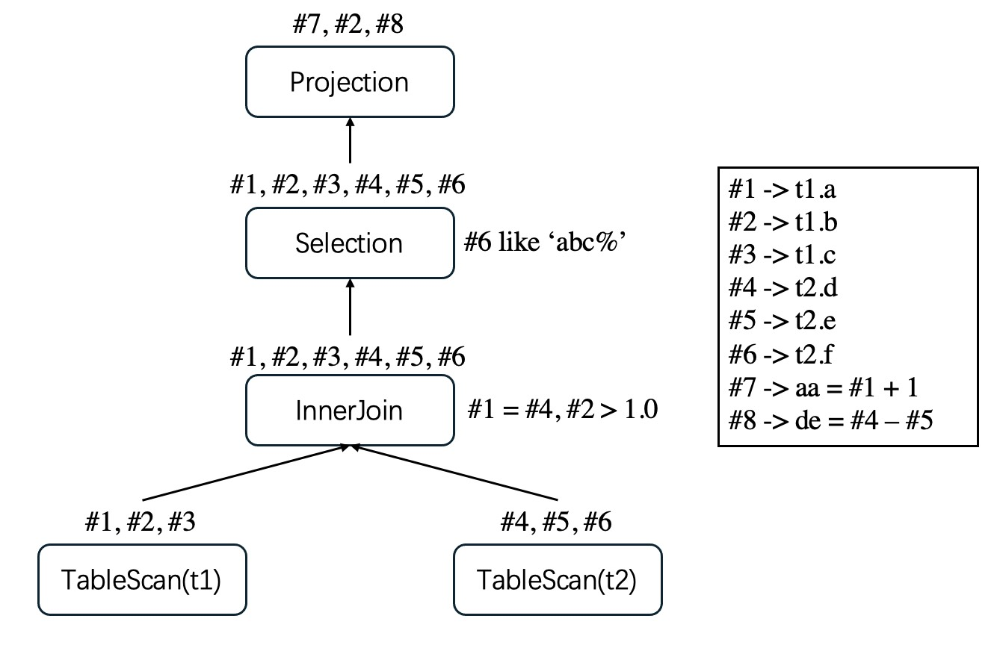

# Logical Plan Node
## Some Quick Facts
- A Logical Plan Node is a tree node in a Logical plan tree

- A plan node may have zero, one or two child nodes

- A plan node receives tuples from its child nodes (in our system, this is implemented by `GoLang Channel`) and apply certain rules to them, such as filtering out rows violating constraints(`Selection`), changing the value of a certain column(`Project`), matching pairs of rows based on join condition(`Join`), aggregating tuples and calculate average, max, or count rows(`Aggregation`), etc. 

## Common Structure
Each node stores metadata for the columns it receives from its child nodes and returns to its parent. This metadata includes the column name, data type, and — most importantly — a unique ID `uid` that identifies the column uniquely within the entire plan. 

For instance, if we have the following table structure:

t1
|column|type|
|-|-|
|a|int|
|b|int|
|c|int|

t2
|column|type|
|-|-|
|d|int|
|e|int|
|f|int|

For query

```SQL
SELECT a+1 as aa, b, d - e as de
FROM t1 JOIN t2 ON b = d AND b > 1.0 
WHERE f LIKE 'abc%'
```
We generate such plan tree:



As shown above, a logical plan node can only build new columns based on the ones it receive from children. The Projection, for example, generates two new columns `#7` and `#8` based on column `#1`, `#4` and `#5` returned by the Selection Node below. Moreover, some columns are deliberately pruned as they are not required, like `#1,#3,#4,#5,#6`. In fact, most databases have an optimizer called `Column Pruner`, which is specifically design to remove unnecessary columns returned by plan nodes. 
