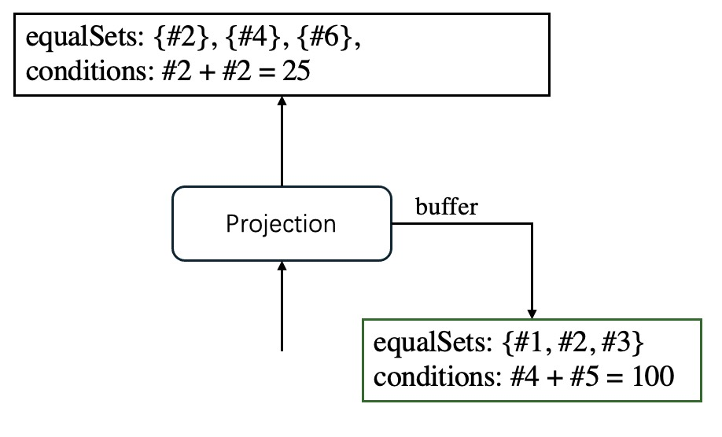

# Predicate Move around
## TL;DR
predicate move around = predicate pull up + predicate transition + predicate push down
## Introduction
### Classic Predicate Transition
Based on given predicates, the database can deduce additional ones to optimize query execution. For example, consider the query:
```SQL
SELECT *
FROM foo f JOIN bar b ON f.id = b.id AND f.id = 100
```
which has the following LogicalPlan:


Thanks to the transitivity of equality, we can infer that *b.id = 100* must also hold for any tuple to appear in the output. Thus, the above SQL is equivalent to:
```SQL
SELECT *
FROM foo f JOIN bar b on f.id = b.id AND f.id = 100 AND b.id = 100
```
The both the predicate *f.id = 100* and the generated one can be push down to nodes below the inner join, resulting in a Plan like this:


Since the filter *id = 100* is applied before, the amount of data flowing into join is reduced. Less data means less memory expense and faster join speed.

### Predicate Move around
Traditional predicate transition typically derives new predicates only at join nodes, using conditions from the JOIN ON clause. In contrast, our algorithm infers predicates from all explicitly and implicitly defined conditions throughout the entire plan tree. Here is an example:

```SQL
SELECT * 
FROM (
        SELECT * 
        FROM t1 JOIN t2 ON id1 = id2
    ) temp1 
    JOIN 
    (
        SELECT * 
        FROM t3 JOIN t4 ON id3 = id4
    ) temp2 
    ON temp1.id1 = temp2.id3 
WHERE id4 > 2020;
```


(For clarity, I labeled each node.)

If we only iterate from top to bottom, at node 3, we only have `id4 > 200` and `id1 == id3`, which alone don’t allow us to infer much. By comparison, our algorithm performs a pull-up before push-down, effectively "gathering information" from all nodes. 

For instance, at node 4, we learn `id1 = id2`, and at node 5, we have `id3 = id4`. When we reach node 3, which contains `id1 = id3`, we can infer that `id1 = id2 = id3 = id4`. Upon arriving at node 2, we can deduce that `id1 = id2 = id3 = id4 > 2020`.

With this knowledge, during push-down phase, we generate predicates `id1 > 2020`, `id2 > 2020`, `id3 > 2020`, and `id4 > 2020` and push them just above the table scan node.

An optimized Plan tree looks like:


### Recognizing Redundant Predicates
Deriving as many predicate as possible is not always beneficial. Considering the following query:

```SQL
SELECT *
FROM (
    SELECT id1, id2 
    FROM t1, t2
    WHERE id1 = id2
    ) temp1 JOIN t3 ON id1 = id3
```

It is easy to infer that `id1 = id2 = id3`, but adding an extra  predicate like `id2 = id3` does not improve performance - in fact, it can slow down execution due to increased computational overhead or redundant checks.

We consider a newly derived predicate P to be `redundant` if it can be inferred from the set of all predicates already present in the subtree rooted at the lowest plan node N to which P can be pushed.

## An Overview of Logical Plan Nodes
[Logical Plan Node](../architecture/logical_plan_node.md)

## Algorithm Implementation
Different from the regular practice in papers, where a closure of predicates is generated, our approach is to 'infer only when necessary' - we do not generate predicates as much as possible(predicate closure) and eliminate redundancy afterwards. Instead, only meaningful and "pushable" predicates are deduced.

### Data Structure
``` c++
struct PredicateSummary {
    // a disjoint set
    equalSets set<set<uid>>
    // predicates
    conditions expression[]
} 
```
The struct PredicateSummary is, as its name suggests, a summary of the predicates a node implies. It has two members - `equalSets` and `conditions`.

#### EqualSets

`equalSets` is a collection of sets of `UIDs`; `UIDs` in the same set are considered equivalent, as they have the same type and value. For instance, given these predicates: `#1 = #2`, `#1 = #3`, `#4 = #5`, the resulting equalSets would be: `{{#1, #2, #3}, {#4, #5}}`.

#### Conditions

`conditions` is a list of `expressions`. An `expression` is a predicate that *DOES NOT* having the form `col1 = col2`; otherwise it should be recorded in `equalSets` instead. A typical `conditions` looks like 

`[#1 + #2 = #3, #4 < 100, concat(#5, #6) is like '%123%']`

A predicate in `conditions` should be interpreted as "a relation among equivalent sets", rather than "a relation among columns". Considering the following equal sets:

```
EqualSets: {#1, #2, #3}, {#4, #7}, {#5, #6}, {#8}, {#9}
```

The predicates:
```
#1 + #2 - f(#4) * g(#5) = #8 + #9
```
should be construed as a 'template'
```
$0 + $0 - f($1) * g($2) = $3 + $4
```
where the $ are placeholders -- `$0` stands for the first equivalent set, `$1` stands for the 2nd equivalent set, etc... In this way, a predicate reveals the arithmetic relation among equivalent sets. By replacing every placeholders with a column from its corresponding set, a valid predicate is generated. In the example given above, in total `3 * 3 * 2 * 2 * 1 * 1 = 36` different predicates can be generated. But again, we only generate new predicates when needed.


### Two Phases
Predicate Move Around is implemented in two steps -- predicate pull up and push down. 

#### Pull Up


In the pull up phase, every node(except the table scan) receives from its child a `PredicateSummary`, which is processed differently according to the nature of the node to generate a new `PredicateSummary`. The newly generated summary is then returned to its father node, where further modifications are made. Similar to a bubble rising to the water surface, one by one, the `PredicateSummary` ascends from the leaves to the root.

Our pull up interface looks like:

```c++ 
struct Pullable {
    virtual PredicateSummary* PullUp() = 0;  
}

class SomeNode : public Pullable {
    PredicateSummary* PullUp() {
        PredicateSummary* child_summary = this->child->PullUp();
        // modify the summary based on its own information
        this->ModifySummary(child_summary);
        // after modification
        return child_summary;
    }  
}
```

#### Push Down

The push down phase begins upon the finish of the pull up phase. The summary returned by root now traverses down from root to leaves. While permeating through a node, the summary changes accordingly. Meanwhile, some new predicates may be generated and are attached to the node. When a summary reaches the leaf nodes, which are usually Table Scans, it 'flattens' itself into a group of predicates and becomes a `Selection` Node, hanging just above the leaves.

```c++ 
struct Pushable {
    virtual void PushDown(PredicateSummary*) = 0;  
}

class SomeNode : public Pushable {
    void PushDown(PredicateSummary* parent_summary) {
        // modify the summary based on its own information
        this->ModifySummary(&parent_summary);
        // after modification
        PushDown(this->child);
    }  
}
```


For a certain plan node, if we name as `summary_up` the predicate summary returned by it during pull up phase, and `summary_down` the summary it receives from its father during push down phase, it's always true that `summary_up <= summary_down`. In other words, the `summary_down` always contains more "knowledge" or "information" than `summary_up`. 

Another thing is certain: **a summary received by a node must include and only include columns returned by its children**.

### Pull Up and Push Down Logic
Since the pull-up and push-down logic are closely related, the algorithm is explained node by node, with each node followed by its corresponding pull-up and push-down details.

#### TableScan
##### Pull up
A table scan does not have any predicates, so the pull up process is quite simple: create an empty summary and add all output uids into summary.equalSets, each of them forms a separate equal set.
##### Push down
As table scan has no child, summary must be converted back into a group of predicates, which are then carried by a `Selection` node. 

Similar to stringing some pearls into a necklace, the process of flattening `equalSets` is using equation marks to connect each column in the same set. 

```c++
flatten([ {#1}, {#2, #3, #4}, {#5, #6} ]) = [#2 = #3, #3 = #4, #5 = #6]
```

Since `conditions` contains predicates that can be used directly, we can add them to the `Selection` Node.


PS: A better practice would be converting predicates into new conditions more 'favored' by database through substituting columns. After replacing column with an indexed(and equivalent) one, a new predicate usually outperforms the original one thanks to the more efficient index scan. 

#### Selection
##### Pull up
As a `filter node`, a `Selection` has one or multiple predicates, which are connected with `AND`. We check if each of them owns the form `col1 = col2`. If so, we consider them equivalent and merge their corresponding equivalent sets in the `PredicateSummary` returned from the child node (if they belong to different ones). Otherwise, such predicate is added directly to the `condition` member.


##### Push Down
The only thing we need to do is to delete the Selection node. During the pull-up phase, all relevant information was stored in `PredicateSummary`, referred to as `summary_up`. Now, the summary received from the parent node, `summary_down`, contains at least as much information as `summary_up`. Therefore, the Selection node provides no additional value and can be considered redundant.


#### Projection
A projection node removes unwanted columns and does computation over several columns to generate new columns. It corresponds to the `SELECT` clause. For instance:

If a table foo has four columns, `a, b, c, d`, the for query
```SQL
SELECT a + b, c as cc
FROM foo
```
Project computes the sum of column `a` and `b`, renames column `c` `cc` and removes the unwanted column `d`.

Define the columns returned by child as `input` and columns returned by projection `output`, we classify a column into three categories:

- Survivors: columns appear in both input and output
- Victims: columns appear in input but not output
- Newcomers: columns appear in output but not input


For example, in the image above, we have:
| category | columns|
-----------|---------
|survivors | #2, #4 |
| victims | #1, #3, #5 |
| newcomers | #6 |

##### Pull Up
Since node must return a summary containing only the columns returned by itself, we need to pay special attention to `Victims`, columns cannot appear in the returning summary.

Let's look at `equalSets` first. If a victim appears in some set with more than one element, such equal relation is lost if we directly remove victims from that set - there's no way to add them back in push down phase. 


Take the picture as an example, in the child summary, we have an equivalent set `{#1, #2, #3}`. If we just remove `#1` and `#3`, when we do push down, there is no way to recover `#1 = #2 = #3`. Therefore, we need to save the equivalent set in a buffer before filtering out the victims.

```
for eqSet in childSummary.equalSets:
    if eqSet contains victims:
        eqSet.copy() -> node.buffer
        eqSet -= victims
```

Similarly, a predicate in `conditions` which contains victims cannot be easily removed. Instead, we try to infer an equivalent one if possible in that we hope to "report" as much information as possible. The first predicate in the image is `#1 + #2 = 25`. Since `#1` is a victim, we cannot keep it in `conditions`. However, we have `#1 = #2`, from which infer `#2 + #2 = 25`, a new condition containing only survivors and is therefore safe to be returned by Projection. We fail to deduce a new predicate from the second predicate `#4 + #5 = 100`, so it should be sended to buffer.

After pull up, the summary and buffer looks like:



##### Push Down
During the push-down phase, columns that appear only above the `Projection` node — referred to as `newcomers` — cannot pass through it directly. Removing `newcomers` from the set causes information loss. For example, if we have an equivalent set `{#2, #5}`, where `#5` is newcomer, erasing `#5` from the set causes the loss of information `#2 = #5`. Thus, `newcomers` must be and can always be rewritten as expressions composed of columns that are known to the nodes below, namely `survivors + victims`. 

We go through equalSets and check each set, if it contains `newcomers`, we must generate predicates before removing these columns. For instance,


`#6` is a newcomers, from its definition we know `#6 = #3 + #5`. We generate the following expression:
> #4 = #3 + #5

Pseudo code of the algorithm:

```c++
// convert equalSets into a list of predicates
for set in equalSets:
    if set.size == 1:
        continue
    if set does not contain newcomers:
        continue
    survivors, newcomers = set.split()
    new_predicates = expressions[]
    if survivors.size == 0:
        // all elements are new comers
        // generate and add predicates:
        new_predicates add "newcomers[0] = newcomers[1]"
        new_predicates add "newcomers[1] = newcomers[2]"
        new_predicates add "newcomers[2] = newcomers[3]"
        ...
        new_predicates add "newcomers[n-2] = newcomers[n-1]"
    else:
        // at least one element is a survivor
        pivot = survivors[0]
        // generate and add predicates:
        new_predicates add "pivot = newcomers[0]"
        new_predicates add "pivot = newcomers[1]"
        new_predicates add "pivot = newcomers[2]"
        ...
        new_predicates add "pivot = newcomers[n-1]"
    // convert all new comers into expressions
    for pred in new_predicates:
        substitute newcomers[i] into expresssions[i]

```

The generated predicates goes to `conditions` in the summary.

In a similar way, we check all predicates in `conditions` and replace `newcomers` with their corresponding expressions. We can change the first predicate of `conditions`, that is, `#2 - #6 = 23`, into `#2 - (#3 + #5) = 23`.

After we finishing processing `equalSet` and `conditions`, we need to merge the summary with the one stored in buffer, if exists, to build the final summary sent to child.

#### Limit
##### Pull Up
`Limit` keeps a certain number of rows without changing their values, so no further modification on summary is required. A natural practice is to directly return the child summary to father, but due to the reason to be discussed, we keep in buffer an extra copy of summary.


##### Push Down
`Limit` is fascinating for its semipermeability - summaries from the child node can flow upward to its parent, but not the other way around. The reasoning is simple: predicates above a `Limit` are evaluated after the `Limit` has already restricted the number of rows. If we push such a predicate below the `Limit`, it might filter out rows prematurely, allowing different rows to reach the `Limit` — and that would change the query's result.

Knowing that a summary should not fall through a `Limit`, a natural practice is to flatten the summary into predicates, which goes to to a newly generated `Selection` node hanging above the `Limit`, like what we do in `TableScan` chapter. After that, we use the summary stored in buffer for further push down. This approach works, but at the same time causes the 'redundant predicates' problem. Recall that in pull up phase, we returned the child's summary directly, call it `summary_up`, so now, the summary received from parent node, namely, `summary_down`, must have contained at least as much "information" as `summary_up`. 

Taken the following image as an example:


From the `equalSet` in `summary_up`, we know that `#3 = #4` and `#5 = #6`. These two equations still hold in `summary_down`. Checking the `conditions`, we see that `#1 - #2 = 10` appears in both `summary_up` and `summary_down`. Condition `#3 > 15` in `summary_up` changes into `#2 > 15` in `summary_down`, which is its equivalent form since we have `#2 = #3`. In fact, the judge of equivalent for predicates is a tricky point we shall cover later on.

**equalSet Processing**

Comparing `equalSets` from `summary_down` and `summary_up`, we found a new equation - `#2 = #3`. This piece of information must have come from a node above, and it should not pass through `Limit`. Notably, new predicates(equations over columns) can "glue" several sets together, forming a larger one. What we need to do is to "tear" it apart into their original forms. But can we always achieve this?

The answer is yes. The rationale behind is simple: except for `Projection`, an equivalent set in `summary_up` is always fully contained in some equivalent set of `summary_down` because there's no operation to "unequal" them.

Partitioning a set losses information - when we rip off `#2` from `{#2, #3, #4}`, the equation `#2 = #3` is lost. Thus, we need to stored it a `Selection` node. In conclusion, our algorithm of tearing a single set is:

> For each set, split it into`n` smaller subsets based on summary_up. equalSets. Pick one column from each subsets(a nice practice is to choose those with indexes) and generate `n-1` equations. 
> Assume the following columns are chosen from subsets:

> #1, #2, #3, #4, ..., #n.

> We generate:

> #1 = #2, #2 = #3, #3 = #4, ..., #n-1 = #n

The process is similar to tearing a pizza into several pieces, leaving cheese strands connecting every two pieces. The generated predicates are just like these strands, gluing together 'shards' of an equivalent set.

**conditions processing**
A predicate pd1 is considered redundant when there exists a predicate pd2 in `summary_up` such that pd1 is equivalent to pd2. Nevertheless, evaluating equivalency must consult a `equalSets`, since we have two: one in `summary_up` and one in `summary_down`, which one to use? 

The answer is the second one. Revisit the example:


We have the predicate `#3 > 15` in `summary_up`, which means that any tuple reaching the `Selection` node above the Limit has already satisfied this condition. Recall that this `Selection` collects all predicates that could not be pushed down. To pass through it, a tuple must also satisfy the condition `#2 = #3`, which is one of the predicates inside the node. By combining `#3 > 15` and `#2 = #3`, we can infer that `#2 > 15` must also hold. Therefore, adding `#2 > 15` explicitly is unnecessary.

After push down, the plan tree looks like:


#### Aggregation
