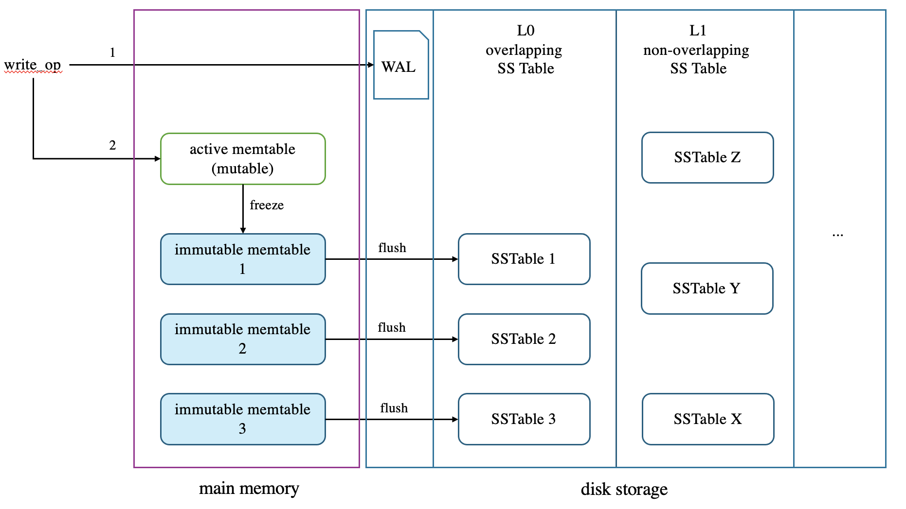

# LSM Tree

## Basic Structure



Two kinds of structures are stored in memory: 

- memtable - theoretically an ordered data structure containing <key, value> tuples, such as an AVL-tree or a RB-tree, but in practice, skip list is usually used (RocksDB).
- an append-only write ahead log - it records write operations to the memtable that has yet been converted into an L0-table.

There is one and only one writable memtable in memory, to which all write operations apply. When memtable reaches certain size, it is frozen and remain immutable ever since. At the same time, a new mutable memtable is created for future writes.

## Write Process

All three write operations are achieved by inserting a <key, value> pair into the active memtable. 

- Put: insert a new key value entry into the table
- Update: insert a new versioned key value pair while keep the old entry (for MVCC)
- Delete: consider it a special update whose value is a tombstone 

Before the changes are applied to the memtable, logs need to be written to WAL in case the process unexpectedly quits, losing all memory state.

## Flush Process

When the size of the active memtable reaches certain threshold, the table gets frozen and becomes immutable. A flush thread converts such table into an L0-SSTable and stores it in disk. Now we may truncate the WAL because the data is durable.  

## SSTable Structure

A typical SSTable looks like this:

```
+---------------------------+
|      Data Block 1         |
+---------------------------+
|      Data Block 2         |
+---------------------------+
|      Data Block 3         |
+---------------------------+
|         ...               |
+---------------------------+
|      Filter Block         |
+---------------------------+
|      Index Block          |
+---------------------------+
|      MetaIndex Block      |
+---------------------------+
|          Footer           |
+---------------------------+
```

Each part has unique responsibility. 

For simplicity, we refer `BlockHandle` a struct containing <block_offset, block_size>.

### Footer

Footer is fixed sized, 48 bytes, and is always at the end of the file. Accessing this part is just a `read(file_size - 48, 48)`. It stores the BlockHandles of index block and meta index block. 

Question: Why not store the footer at the start of the SSTable since it is fixed sized? 

Answer: Because the offsets and sizes of index and meta index block are unknown initially. Patching them later on requires a second pass, breaking the constraint that an SSTable should be sequential append only.

### MetaIndex Block

The MetaIndex Block is variable-sized, containing the block handle of filter block, index block, etc... You can think of it as a table of contents for all the optional auxiliary blocks (non-data blocks) such as:

- compression dictionary block: used when zstd dictionary compression is enabled.
- Range properties block: stores min/max keys for each block.

### Filter Block

The filter block contains multiple bloom filters to speed up the query process. Each filter corresponds to a data region made up of `1<<base_lg` data blocks. The number of keys in each block varies, so the Bloom filter for each block uses a different number of bits, and that's why we need an offset array marking the start address of these filters.

```
+-----------------------------+
|  Filter bits for region 0   |
+-----------------------------+
|  Filter bits for region 1   |
+-----------------------------+
|  Filter bits for region 2   |
+-----------------------------+
| ...                         |
+-----------------------------+
| offset[0] (uint32)          |
| offset[1] (uint32)          |
| offset[2] (uint32)          |
| ...                         |
+-----------------------------+
| offset_of_offset_array (u32)|
| base_lg (u8)                |
+-----------------------------+
```

When LSM tree looks for a certain key, it first consult the filter block to generate several candidate data regions. Since each region corresponds to certain a group of blocks, these candidates can be used to narrow down the range when we do index scanning.

### Prefix Compression And Restart Array

Before diving into the index block and data block, we need to explain a commonly used space-saving optimization - prefix compression and restart array.

In SSTables, keys are often sorted in dictionary order,  so a key is likely to have a common prefix with keys before it. We can divide all keys into several groups (the usual group size is 16.). In each group, we keep the first key intact, and for each key in the same group, we only need to record the length of the prefix it shares with the first key and the different part. For instance, if a group of keys are `apple, application, apply`, we may store:

```
"apple"
common_prefix_len = 4, diff_len = 7, different_part = "ication"  (for "application")
common_prefix_len = 4, diff_len = 1, different_part = "y" (for "apply")
```

This optimization is called `Prefix Compression`.

After we split the keys into groups, we need to store the offsets of the first key in each group into an array, called a `Restart Array`. It looks like:

```
+-------------------------+
| Entry 0 offset          |  <-- offset of a full key in the block
| Entry 1 offset          |
| ...                     |
| Entry K offset          |
+-------------------------+
| Number of entries (K+1) |
+-------------------------+
```

The restart array makes binary search possible.

### Index Block

Conceptually, the Index Block stores the <first key in a data block, block offset> entries to help us locate the right block given a key. Searching for an entry in index block can be done with the aid of the restart array.

`````
+----------------------------------------------------------+
| Index Entry 0                                           |
|   shared_key_len | unshared_key_len | value_len         |
|   unshared_key_bytes | block_handle (offset+size)       |
+----------------------------------------------------------+
| Index Entry 1                                           |
|   ...                                                   |
+----------------------------------------------------------+
| ...                                                     |
+----------------------------------------------------------+
| Restart Array                                           |
|   [offset_0, offset_1, ..., offset_k][num_restarts]    |
+----------------------------------------------------------+
| Block Trailer (CRC/checksum + compression type)        |
+----------------------------------------------------------+

`````

The steps are:

1. **Binary search** in restart array → find nearest full key ≤ target
2. **Sequentially decode prefix-compressed entries** from that restart point
3. Find the **block handle** of the candidate data block
4. Read that **data block** to find the actual key/value

### Data Block

A data block stores the real <key, value> pair, using prefix compression and restart array for binary search.

```
+------------------------------------------------------+
| Entry 0                                              |
|   shared_key_len | unshared_key_len | value_len      |
|   unshared_key_bytes | value_bytes                   |
+------------------------------------------------------+
| Entry 1                                              |
|   ...                                                |
+------------------------------------------------------+
| Entry 2                                              |
|   ...                                                |
+------------------------------------------------------+
| ...                                                  |
+------------------------------------------------------+
| Entry N                                              |
|   ...                                                |
+------------------------------------------------------+
| Restart Array                                        |
|   [restart_offset_0, restart_offset_1, ..., offset_k]|
|   [num_restarts]                                     |
+------------------------------------------------------+
| Block Trailer                                        |
|   CRC32 checksum + compression type (optional)       |
+------------------------------------------------------+
```

## Compaction Process

After an immutable memtable gets flushed in disk, it becomes an L0-SSTable. Overtime, multiple SSTable accumulates and they may have overlap key ranges, as a result, querying for a key must be routed to several L0-tables, causing read amplification. Also, obsoleted key, value pairs wastes disk storage. To solve these issues, a compaction thread merges L0 tables into non-overlapping L1 tables.

The process is quite intuitive, the L1 compaction thread picks several L0 tables and since L1 must be non-overlapping, it must compact all L1 files whose key ranges overlap with any picked L0 tables. So:

```
selected_L1_files = all L1 files where range(L1) intersects any range(L0)
```

Considering all L0 and L1 tables are sorted, then the thread performs a k-way merge-sort to generate new L1 tables. In the process:

- newest key versions get kept (L0 > L1) 
- deleted keys get discarded 
- Old version gets discarded if no snapshot references it (MVCC is covered in the later chapter)

Newly generated SSTables are not necessarily larger than an L0 table. In fact, take rocksDB as an example, its L0, L1 tables are roughly 64MB each.


## Query Process

Although there are multiple query patterns, we concentrate on just three - Point Select(Lookup), Range Scan and Sequential Scan.

### Point Select

The scenario is quite simple - given a single key, return its value.

The entire lookup runs on a single thread. Recall that every L0 SS table is generated from an immutable table, which was once the active memtable, there is a clear newest-to-oldest order linking these tables. 

1. The search starts from the active memtable, if a visible key (MVCC) or a tombstone(a delete flag) is found, the value can immediately be returned since it must be the newest record. 
2. Otherwise, the immutable tables are searched sequentially, from the newest to the oldest. 
3. If again, no record is found, L0 SSTables are checked. Considering L0 SSTables can have overlaps, all tables whose key ranges cover the target key must be check.
4. If we fail to find an entry in L0 SSTables, L1 Tables are searched. Luckily, SSTables are non-overlapping, so we only need to check one table.
5. Serach in L2, L3, ...    

Searching a key in a memtable is fast in that it is a sorted skip list located in main memory, so it only takes O(log n) time. Finding a key in an SSTable is slightly more involved but still efficient: we use bloom filters to identify candidate regions, then consult the index block to locate the correct data block, and finally perform a binary search within that block using its restart array.

### Range Scan

The definition of range scan is: given a start key and an end key, return entries within the given range.

Each key within the range can be anywhere - active memtable, immutable memtables, L0 SSTables, L1 SSTables, ... A k-way merge iterator is used:

```
Iterator:
    active memtable iterator
    immutable memtable1 iterator
    immutable memtable2 iterator
    (one per memtable)
    ...
    L0 sstable1 iterator 
    L0 sstable2 iterator 
    L0 sstable3 iterator
    ...
    (one per sstable within the range)
    L1 iterator
    L2 iterator
    ...
```

Each iterator yields the next key in sorted order, and a small min-heap chooses the smallest key across all sources.

The searching process can be divided into two phase:

1. Locate the iterators at each level, for instance, for an L0 SSTable overlapping with the given range, we need to generate an iterator pointing to the first element >= start_key.
2. Maintain a minimal heap of iterators, choose the smallest key (pops the top element), advance the iterator that provides it and insert back the moved iterator.

### Sequential Scan

Just consider it a range scan over all keys.

## MVCC

When a client put a tuple into the LSM tree, a global sequence number is generated and attached to the key, so a key in memtable looks like:

``` 
(internal_key = user_key + sequence_number + type)
```

We never do in-place update on memtable - old version and new version coexists for they have different internal key. During reads, we check from memtables to SSTables to find the first key with sequence number <= snapshot sequence number. To facilitate the process, RocksDB arranges sequence number in descending order, making the newest version appear first.

Only in compaction process can an old version be removed, if there is no snapshot referencing it.


