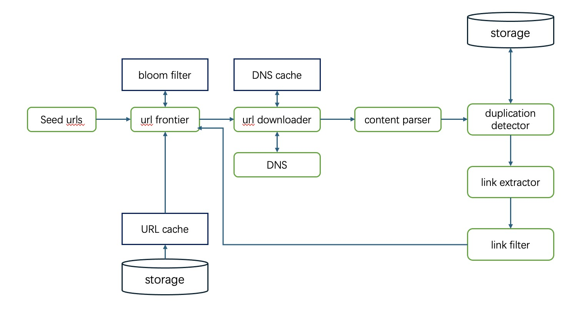
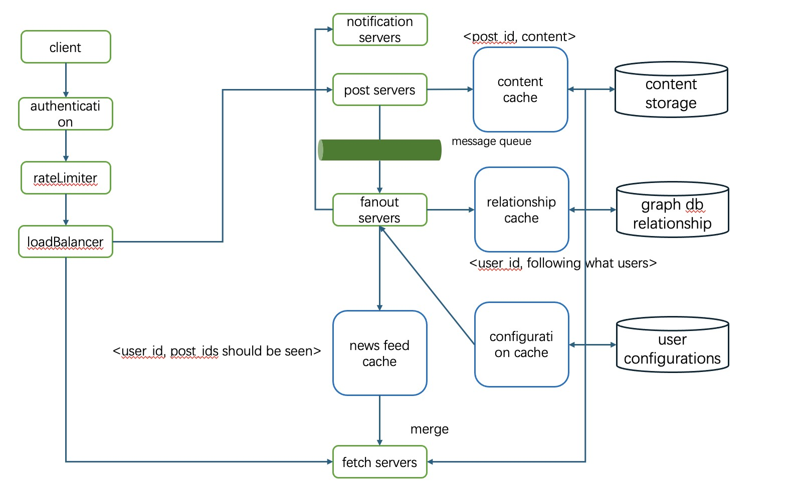
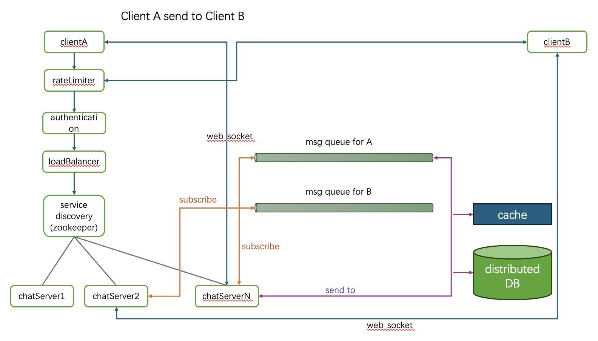
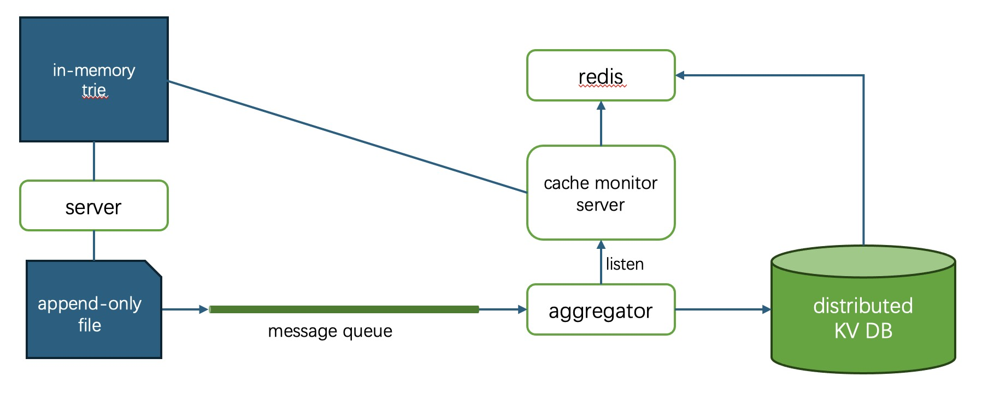

# System Design


## Rate Limiter

## Consistent Hash

## ID Generator

## URL shortener

## URL Crawler
### Framework


### URL Frontier
- normalize url first
- remove duplicate url -> bloom filter + db
- ensure politeness -> unique queue for each host + next_available_time + heap
- ensure priority -> priority queue based on pageRank, url depth, freshness
- consistent storage -> cache + db
- scalability -> multiple instance + hash(url)
- freshness -> recrawl some web:based on update history

### URL downloader
- DNS cache
- multiple worker -> multiple thread on a single server + multiple servers
- dead url -> time out
- robot.txt -> avoid breaking rules
- be careful of spider traps

### Content Parser
recognize worthless content or ads, spam URLs

### Duplication Detector
normalize web content, then hash the content, check if such hash exists in storage

## News Feed System
### Framework


## Chat System

### Connection Type
#### Polling
Client frequently ask server for new messages, and server immediately respond. 
- Pros: simple
- Cons: handling too many requests is a challenge to server

#### Long Polling
Client build a connection to server and waits for a long time. Server responds if there is a message or timeout. Upon receiving a reply, client create new connection to server.
- Pros: less requests and faster respond time.
- Cons: server must maintain opened connections; one connection servers only one batch of messages; small latency when creating new connection.

#### WebSocket
Create a persistent, full-duplex connection between client and server.

Start a http request and then upgrade to websocket. Once such socket is established, both the client and server may send data anytime.

- Pros: Realtime communication; no repeated connection request; bi-directional 
- Cons: complexity

### Service Discovery
After rate limiter, authentication and load balancer, we need to select a chat server to establish web socket connection. Service Discovery is this process - it maintains the status of all chat servers, such as whether they are online and their workloads. Zookeeper is a classic choice.

### Chat Server
After login, a web socket connection is established between user and the chat server. The chat server subscribes from the message queue corresponding to user_id, and send back messages to client. 

1-to-1 connection 

When a user A sends a message to another user B, the server fetches a message id from id generator, send the <msg_id, content> pair into the message queue corresponding to B. Also, it is stored in DB for future query.

### Storage
Table DDL:

|message_id(pk)|sender_id|receiver_id|content|timestamp|status|
|---|---|---|---|---|---|
|101|A|B|"Hello"|1730|delivered|


### Online Presence
use db to store the user status, client uses heart beat to notify the server his liveness. The presence server may registers the client in zookeeper. Whenever there is a heart beat, it updates the last timestamp in zookeeper, and periodically check if a timestamp is too old. If so, the server consider the user offline and broadcast this information to its friends.

### Search Autocomplete System
- Data gathering service

Gather user input and aggregate them in storage.

- Query service

Find top K searched questions based on a prefix.

#### Data Structure - Trie

Conceptually, we can use trie to store queries and their frequency. We may further store top K results at each nodes for faster query. 

Query with certain prefix only takes O(len) time. 

#### Storage
We store <query, frequency> pairs in DB. And since we often execute queries with 'like prefix' predicates, KV based DB is more ideal then Mysql, since it has no SQL layer. An example of such query looks like:
```sql
SELECT query
FROM frequencies
WHERE query LIKE 'some_prefix%' 
ORDER BY frequency desc
LIMIT k 
```

In addition, it's unlikely that we can store the whole trie in a single db, which would also bring single spot failure risk. Sharding based on prefix is a good idea. We can have a server analyzing each prefix and determine which prefix goes to which DB and divide them as evenly as possible.

An example of frequency table looks like:
```sql
CREATE TABLE frequencies (
    query VARCHAR(255) PRIMARY KEY,
    frequency BIGINT,
    last_updated TIMESTAMP
);
```
The last_updated is used for frequency decay.

#### Two-Layer Cache
Query DB for top K result is time consuming, so we may cache results in redis servers for future retrieval. The entries in redis looks like:

<query, [top1, top2, top3, ..., topK]>

Another layer of cache can be build just in the query server. We keeps in memory a real trie.

#### Gathering Service


Each query server keeps an append-only log recording the full query. The log content is flushed into a message queue periodically. Aggregating services accepting these logs and update the KV database. It may also send message to another queue, which is subscribed by a redis-update-service. That service detects what entry in redis should be invalidates and it computes new values for it if necessary.

#### Browser Cache
prefix -> top k result relationship can be cached in browser.


